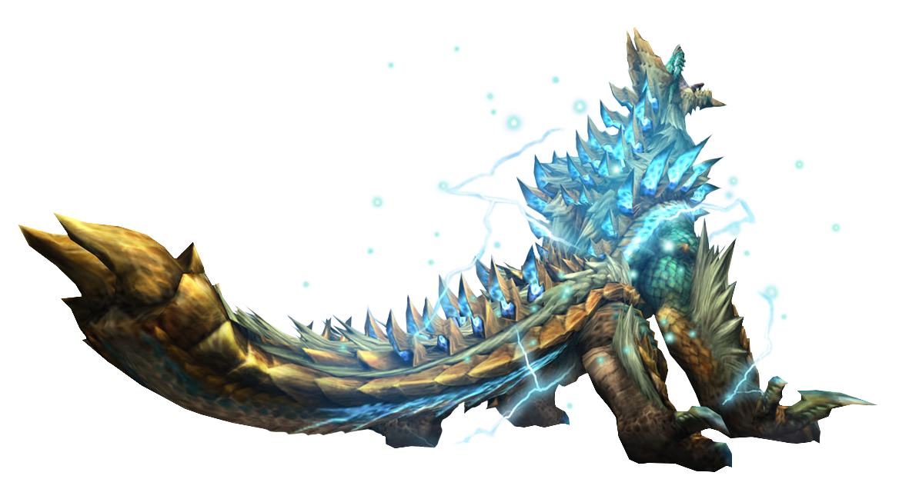

---
# Feel free to add content and custom Front Matter to this file.
# To modify the layout, see https://jekyllrb.com/docs/themes/#overriding-theme-defaults

layout: home

latestGame: mhp3rd

latestGameShort: MHP3rd

latestGameName: "Monster Hunter Portable 3rd"

latestTrailerID: "wsGVYFBxY88"

previewItems:
 - image: "screens-1.png"
   heading: "An Ecological Marvel."
   subheading: "Past Monsters re-textured to stand more fearsome than ever before!"
   link: "/mhp3rd/monsters"
 - image: "screens-2.png"
   heading: "With All The Comforts Of Home."
   subheading: "HD Yukumo Village is open to all hunters, from farm to faculties!"
   link: "/mhp3rd/village"
 - image: "screens-4.png"
   heading: "The Same Great Hunts."
   subheading: "Vibrant visuals and UI redesign gives new life to the classic Monster Hunting experience!"
   link: "/mhp3rd/ui"

---

<section id="top-header">

	
		

			<a href = "https://youtube.com/" class = "play-btn">
				
				
Watch the Trailer

			</a>
		

	
	

		

			<h1 class="slogan main">
				{{ page.latestGameShort }} Redux.
			</h1>

			<h1 class="slogan back">
				HD Texture Pack.
			</h1>

			

				<button class="latest-rls">
					Download Latest Release
				</button>
			

			

		

		
	

</section>

<section id = "content-center">

	
	

		

			

			<h3>

				{{ previewItem.heading }}

			</h3>

			

				{{ previewItem.subheading }}
			

			

				<a  href = "{{ previewItem.link }}" 
					alt = "Link to game details"
					class = "link-btn"
				>
					View Details
				</a>
			

		

	

	

</section>

<section id="gallery">
	
</section>

<section id = "home-bottom">
	
	

		
		

			
		

		

			<h3 class = "with-bars">High Quality Hunting.</h3>

			

				<button class="btn">Download Texture Pack</button>
			

			

				<a href="https://ppsspp.org" class="ppsspp_logo">Only on PPSSPP</a>
			

		

	

</section>